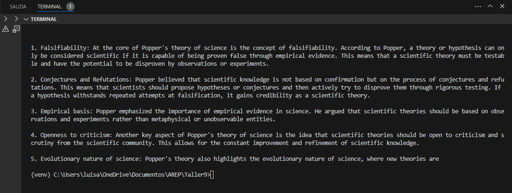
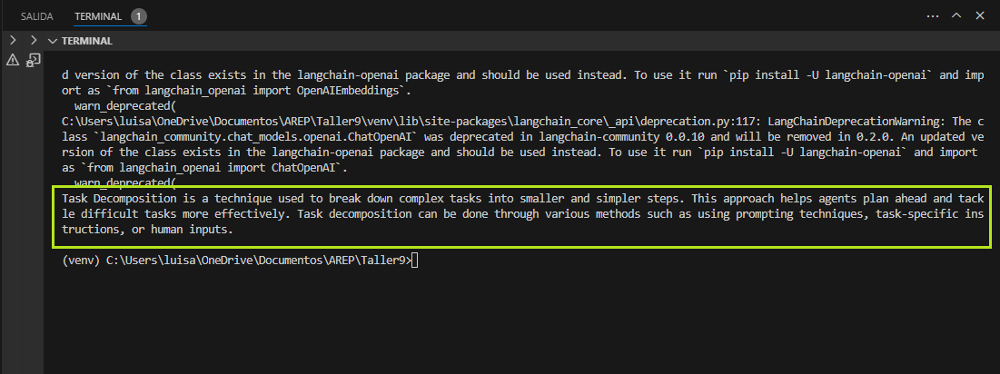
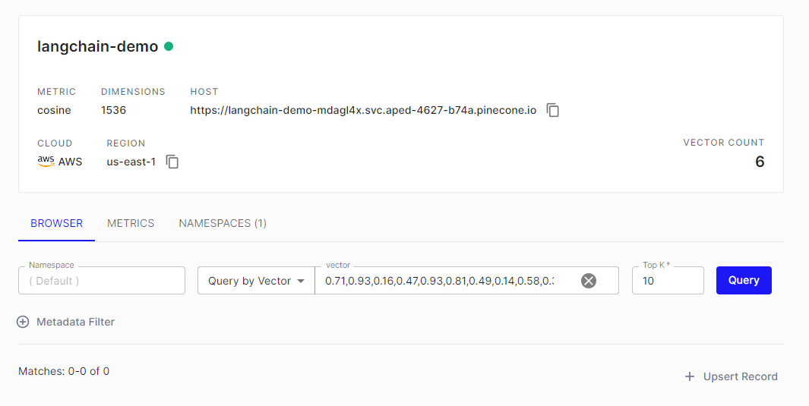
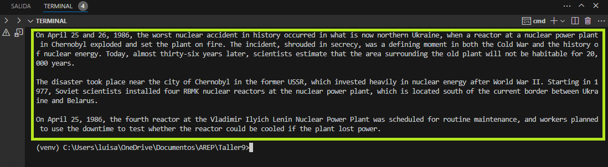

# TALLER 9: Large Language Model

El objetivo principal de este taller era construir un sistema de búsquedas eficientes dentro de un conjunto de documentos, para lo cual se usó la biblioteca de LangChain y el servicio de almacenamiento de vectores de Pinecone. 

## Prerequisitos

* Python 3.10.2
* Pip 21.2.4 
* Entorno virtual de Phyton
* OpenAI API Key
* Pinecone API Key

## Instalación y Ejecución

**Nota:** Para la instalación y ejecución de este proyecto se recomienda ejecutar los comandos en una terminal de **command prompt**.

1. Se clona el repositorio:

```
git clone https://github.com/AREP-2024/Taller9.git
```

2. Ingresamos a la carpeta del repositorio que clonamos anteriormente:

```
cd Taller9
```

3. Se crea el entorno virtual de Python:

```
python -m venv venv
```
4. Se activa el entorno virtual de Python:

```
venv\Scripts\activate
```
5. Instalar las dependencias del proyecto:

```
pip install -r requirements.txt
```
6. Configurar las variables de entorno en cada uno de los scripts:

```
["OPENAI_API_KEY"] = "OPENAI_API_KEY"
```

**Nota:** El valor de **OPENAI_API_KEY** debe ser reemplazado por un llave, la cual se puede obtener en el siguiente link https://openai.com/.

```
["PINECONE_API_KEY"] = "PINECONE_API_KEY"
```

**Nota:** El valor de **PINECONE_API_KEY** debe ser reemplazado por un llave, la cual se puede obtener en el siguiente link https://www.pinecone.io/.

Se realizaron tres ejercicios los cuales se presentan a continuación: 

### Challenge No.01:
El primer ejercicio es un programa que envía mensajes a Chatgpt y recupera respuestas. Para ejecutar este ejercicio, digite el siguiente comando:

```
py main.py
```
Luego de ejecutar el programa, el resultado que obtuvimos es la respuesta a la pregunta **What is at the core of Popper's theory of science?** como se muestra a continuación:



### Challenge No.02:
El segundo ejercicio tenemos un RAG simple que utiliza una base de datos vectorial en memoria.Para ejecutar este ejercicio, digite el siguiente comando:

```
py llmmemorydb.py
```

Luego de ejecutar el programa, el resultado que obtuvimos es la respuesta a la pregunta **What is Task Decomposition?** como se muestra a continuación:



### Challenge No.03:
En el tercer ejercicio se escribió un RAG usando Pinecone.Para ejecutar este ejercicio, digite el siguiente comando:

```
py pineconeexample.py
```
Para este ejercicio creamos un índex en Pinecone con el nombre **langchain-demo** y una dimensión de 1536: 



Luego de ejecutar el programa, el resultado que obtuvimos es la respuesta a la pregunta **What happened on April 25 and 26, 1986?** como se muestra a continuación:



## Construido con

* [Python](https://www.python.org/): Es un lenguaje de programación de alto nivel, interpretado y multiparadigma utilizado para una amplia variedad de aplicaciones, desde desarrollo web hasta análisis de datos, inteligencia artificial, aprendizaje automático, automatización, scripting, desarrollo de juegos y mucho más. 
* [Pip](https://pypi.org/project/pip/): Es un sistema de gestión de paquetes utilizado en Python para instalar y administrar bibliotecas de terceros, también conocidas como "paquetes". El nombre "Pip" es un acrónimo recursivo que significa "Pip Installs Packages".
* [Entorno virtual de Phyton](https://www.python.org/):
Un entorno virtual en Python es una herramienta que permite crear un entorno de desarrollo aislado, independiente del entorno global del sistema. Esto significa que puedes tener diferentes versiones de paquetes y dependencias para distintos proyectos, sin que interfieran entre sí. 
* [OpenAI API Key](https://openai.com/): Es una clave de autenticación necesaria para acceder y utilizar la API de OpenAI. OpenAI ofrece servicios y herramientas de inteligencia artificial, incluyendo modelos de lenguaje como GPT (Generative Pre-trained Transformer), que permiten a los desarrolladores integrar capacidades avanzadas de procesamiento de lenguaje natural en sus aplicaciones y proyectos.
* [Pinecone API Key](https://www.pinecone.io/): Es una plataforma de servicios de búsqueda y recuperación de vectores (vector search), diseñada para facilitar la búsqueda y recuperación de datos basada en similitudes vectoriales. La Pinecone API Key es una clave de autenticación necesaria para acceder y utilizar la API de Pinecone.
* [Visual Studio Code](https://code.visualstudio.com/): Es un entorno de desarrollo integrado (IDE) ligero y de código abierto desarrollado por Microsoft.

## Autor
[Luisa Fernanda Bermudez Giron](https://www.linkedin.com/in/luisa-fernanda-bermudez-giron-b84001262/) - [Luisa Fernanda Bermudez Giron](https://github.com/LuisaGiron)

## Licencia 
**©** Luisa Fernanda Bermudez Giron, Estudiante de Ingeniería de Sistemas de la Escuela Colombiana de Ingeniería Julio Garavito.